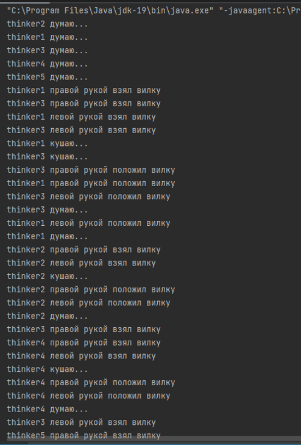
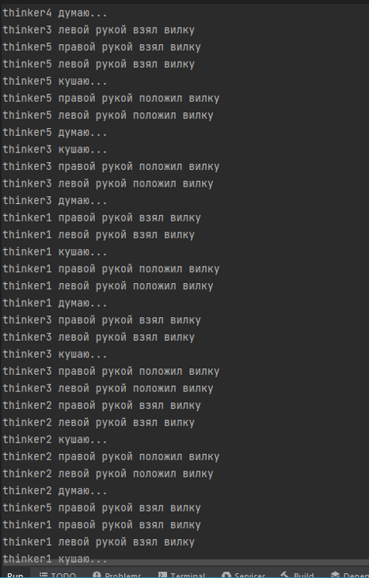
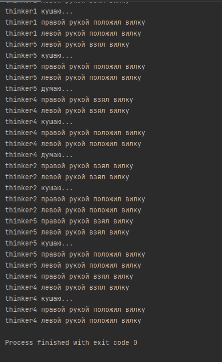
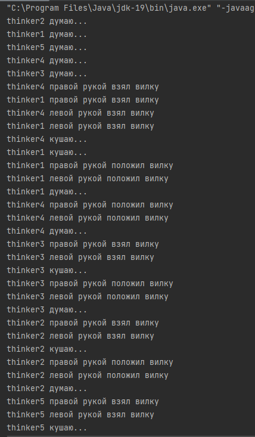
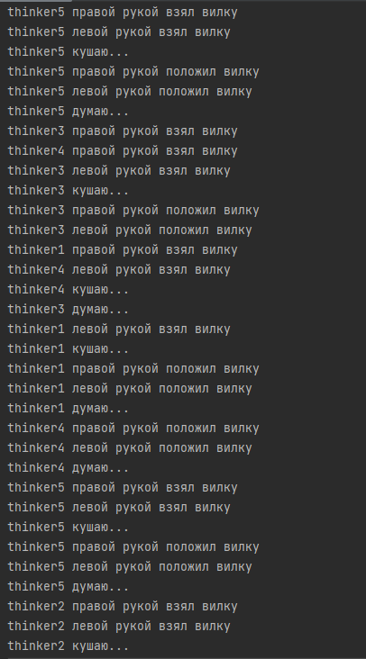
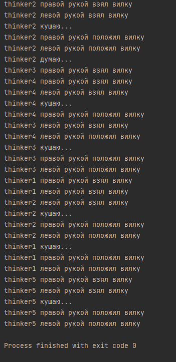

## Многопоточность
* Пять безмолвных философов сидят вокруг круглого стола, 
перед каждым философом стоит тарелка спагетти.
* Вилки лежат на столе между каждой парой ближайших философов.
* Каждый философ может либо есть, либо размышлять.
* Философ может есть только тогда, когда держит две вилки — взятую справа и слева.
* Философ не может есть два раза подряд, не прервавшись на размышления (можно не учитывать)
* Описать в виде кода такую ситуацию. Каждый философ должен поесть три раза

* Скрины вывода

* Повтор

